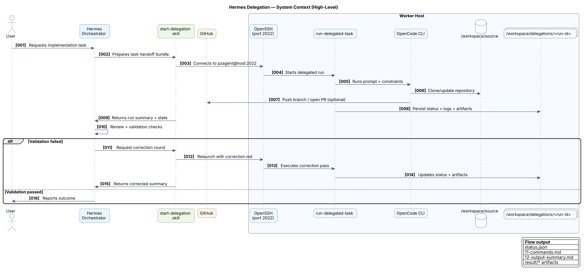
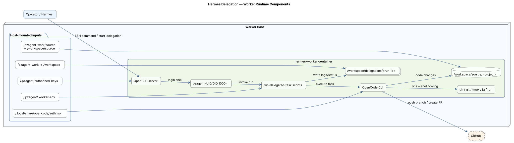
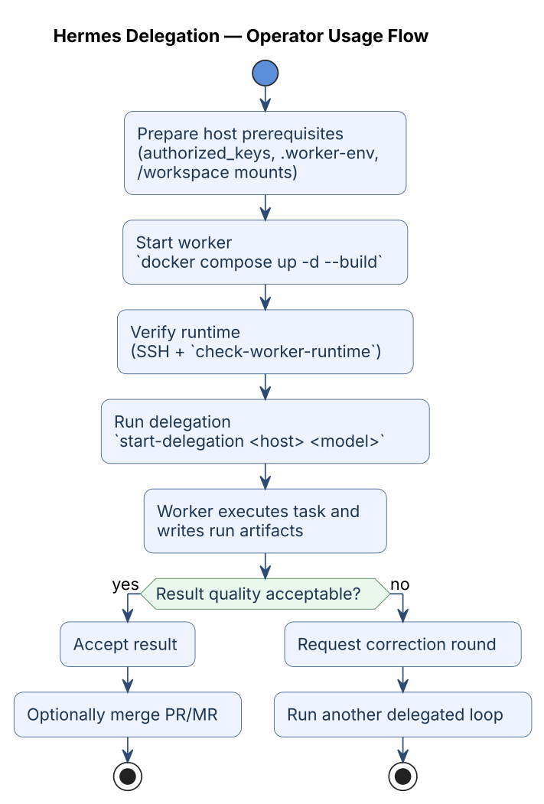

# Hermes Delegation — High-Level Overview

This document explains **what this project is for** and **how to use it** at a high level.

It uses the PlantUML proxy rendering approach (`plantuml-markdown` style), so diagrams are directly visible on GitHub.

## What problem this solves

`hermes-delegation` provides an always-on SSH worker (`pzagent`) that Hermes can delegate implementation tasks to.

Core goals:

- keep delegation execution isolated from the orchestrator host
- standardize handoff format and run artifacts
- make delegated runs observable/reviewable
- keep repository work under `/workspace/source/<project-name>`
- keep run logs and outputs under `/workspace/delegations/<run-id>`

## Where this fits in the workflow

## Typical runtime components

## How to use it (operator flow)

## Minimal usage checklist

1. Set host prerequisites (`~/.pzagent`, `~/pzagent_work/source`, `.worker-env`).
2. Start worker (`docker compose up -d --build`).
3. Verify connectivity (`ssh -p 2022 pzagent@<host>`, `check-worker-runtime`).
4. Run delegation from Hermes (`start-delegation <host> <model>`).
5. Review run outputs in `/workspace/delegations/<run-id>/`:
   - `status.json`
   - `11-commands.md`
   - `12-output-summary.md`
   - `result/` artifacts

## Diagram source of truth

- Source files live under `docs/diagrams/*.puml`
- This document embeds pre-rendered `*.svg` files from `docs/diagrams/`
- If a `.puml` file changes, regenerate and commit the corresponding `.svg`

## Reading order for deeper detail

- Runtime specifics: `docs/worker-runtime.md`
- Handoff structure: `docs/handoff-format.md`
- Failure handling: `docs/troubleshooting.md`
