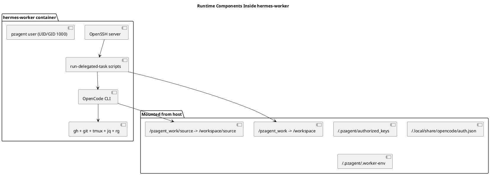
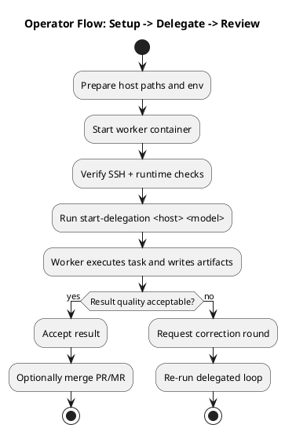

# Hermes Delegation — High-Level Overview

This document explains **what this project is for** and **how to use it** at a high level.

## What problem this solves

`hermes-delegation` provides an always-on SSH worker (`pzagent`) that Hermes can delegate implementation tasks to.

Core goals:

- keep delegation execution isolated from the orchestrator host
- standardize handoff format and run artifacts
- make delegated runs observable/reviewable
- keep repository work under `/workspace/source/<project-name>`
- keep run logs and outputs under `/workspace/delegations/<run-id>`

## Where this fits in the workflow

```plantuml
@startuml
title Hermes Delegation: System Context (High-Level)

actor User
participant "Hermes Orchestrator" as Hermes
participant "start-delegation skill" as Skill
node "Worker Host" as Host {
  node "hermes-worker container" as Worker {
    participant "OpenSSH (port 2022)" as SSH
    participant "run-delegated-task" as Runner
    participant "OpenCode CLI" as OpenCode
  }
  database "/workspace/source" as Source
  folder "/workspace/delegations/<run-id>" as Runs
}
participant "GitHub" as GitHub

User -> Hermes : Request implementation task
Hermes -> Skill : Prepare delegation handoff
Skill -> SSH : Connect to pzagent@host:2022
SSH -> Runner : Start delegated run
Runner -> OpenCode : Execute task prompt
OpenCode -> Source : Clone/update target repository
OpenCode -> GitHub : Push branch / create PR (optional)
Runner -> Runs : Write status + logs + result artifacts
Skill -> Hermes : Return summary + run status
Hermes -> User : Report outcome / request corrections

@enduml
```

## Typical runtime components



## How to use it (operator flow)



## Minimal usage checklist

1. Set host prerequisites (`~/.pzagent`, `~/pzagent_work/source`, `.worker-env`).
2. Start worker (`docker compose up -d --build`).
3. Verify connectivity (`ssh -p 2022 pzagent@<host>`, `check-worker-runtime`).
4. Run delegation from Hermes (`start-delegation <host> <model>`).
5. Review run outputs in `/workspace/delegations/<run-id>/`:
   - `status.json`
   - `11-commands.md`
   - `12-output-summary.md`
   - `result/` artifacts

## Reading order for deeper detail

- Runtime specifics: `docs/worker-runtime.md`
- Handoff structure: `docs/handoff-format.md`
- Failure handling: `docs/troubleshooting.md`
